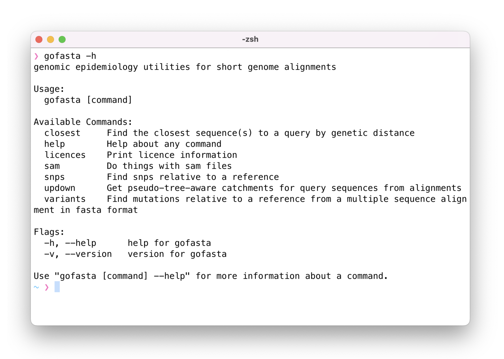

    
# gofasta 

gofasta is a command-line utility developed to handle SARS-CoV-2 alignments, but should be useful more generally for handling consensus genomes of any microbial pathogen. It is used on datasets of millions of sequences, including by the United Kingdom's [daily SARS-CoV-2 genome processing pipelines](https://github.com/COG-UK), [Pangolin](https://github.com/cov-lineages/pangolin) and [Civet](https://github.com/artic-network/civet).

If you use gofasta in your work, please cite [https://doi.org/10.1093/bioinformatics/btac424](https://doi.org/10.1093/bioinformatics/btac424).

## Installation

Binaries are available for Mac OSX and Linux under the [latest release](https://github.com/virus-evolution/gofasta/releases/latest),

or you can install gofasta from Bioconda:

`conda install bioconda::gofasta`

If you have [Go](https://go.dev/) installed, you can run `go install github.com/virus-evolution/gofasta@latest` to build a binary of the latest release locally (maybe in `~/go/bin/`). Branches, commits or tags other than `latest` can be built in the same way.

You can also build the contents of this repository:

```
git clone https://github.com/virus-evolution/gofasta.git
cd gofasta
go build -o gofasta
```

## Commands

For a full list of commands and options, you can run `gofasta` with the `-h` flag at the command line: `gofasta -h`,  `gofasta sam -h`, `gofasta sam variants -h`, etc. 

<p align="center">
  
</p>


e.g., for `gofasta updown list -h`:

<details><summary><b>Click to see the help message</b></summary>

```
❯ gofasta updown list -h
Generate input CSV files for gofasta updown topranking

Example usage:

	gofasta updown list -r reference.fasta -q alignment.fasta -o mutationlist.csv

Non-ATGC nucleotides are not recommended in the --reference, and --reference and --query must
be aligned to the same thing.

--outfile is a CSV-format file with the columns: query,SNPs,ambiguities,SNPcount,ambcount. There is one row
for each sequence in --query. SNPs is a "|"-delimited list of SNPs relative to --reference. ambiguities is
a "|"-delimited list of ranges (1-based, inclusive) of tracts of ambiguities (anything that isn't ATGC).

Usage:
  gofasta updown list [flags]

Flags:
  -q, --query string     Alignment of sequences to parse, in fasta format (default "stdin")
  -o, --outfile string   Output to write (default "stdout")
  -h, --help             help for list

Global Flags:
  -r, --reference string   Reference sequence, in fasta format, which is treated as the root of the imaginary tree
```
</details>

## Usage

### Sam to fasta format conversion

[minimap2](https://github.com/lh3/minimap2) provides fast and reliable pairwise alignments between SARS-CoV-2 consensus genomes. gofasta provides utility functions to convert the sam format alignments it outputs into fasta format.

Pairwise alignments are less computationally demanding than multiple sequence alignment-proper and they offer an efficient approximation to it when sequences are closely related.

<details><summary><b>Making a single alignment with multiple sequences</b></summary>
</br>

This is the pipeline currently used by [Pangolin](https://github.com/cov-lineages/pangolin):

```
minimap2 -a -x asm20 --sam-hit-only --secondary=no --score-N=0 MN908947.fa unaligned.consensus.fasta -o aligned.sam

gofasta sam toMultiAlign -s aligned.sam --start 266 --end 29674 --pad -o aligned.fasta
```

`MN908947.fa` is the reference genome for SARS-CoV-2 (here is its [Genbank accession](https://www.ncbi.nlm.nih.gov/nuccore/MN908947.3)), and `unaligned.consensus.fasta` contains all your consensus genomes (in one file). In this case we've clipped the alignment to just the coding sequence (`--start 266 --end 29674`) but replaced the trimmed regions with `N`s to retain the reference length in the output (`--pad`). <b>Insertions relative to the reference are discarded from the output file so everything is the same (== reference) length.</b>


minimap2 and gofasta can both make use of multiple threads. Additionally, minimap2 writes to stdout by default and gofasta reads from stdin if we don't specify a file for `-s`, so we can avoid writing the intermediate sam to disk entirely. Both of these should speed things up:

```
minimap2 -t8 -a -x asm20 --score-N=0 MN908947.fa unaligned.consensus.fasta | gofasta sam toma -t2 > aligned.fasta
```

We give minimap2 more threads here because it's doing more work. `toma` is just an alias for `toMultiAlign`.

<i>But I don't want to have to write all this code every time I want to align something</i>. That's understandable. In which case you could define a shell function in your `~/.zshrc` or `~/.bashrc` file, something like:

```
function align() {
  minimap2 -a -x asm20 --score-N=0 ~/path/to/MN908947.fa $1 | gofasta sam toma
}
```

and then you can run `align unaligned.consensus.fasta > aligned.fasta` in your terminal.

</details>

<details><summary><b>Making pairwise alignments (including insertions)</b></summary>
</br>
gofasta will also convert the minimap2 alignment into pairwise alignments, writing one file per consensus genome, including insertions relative to the reference and writing the reference itself to the output files:

```
minimap2 -a -x asm20 --score-N=0 MN908947.fa unaligned.consensus.fasta |\
  gofasta sam toPairAlign -r MN908947.fa -o outputdir
```

`outputdir` is a directory which will be created if it does not already exist. Individual fasta files will be written to `outputdir/*fasta`. Filenames are derived from the fasta descriptions (with `/` replaced by `_`).

Just as with `toMultiAlign`, you can clip the alignments to coordinates of your choosing. For example, if you are only interested in the Spike region:

```
minimap2 -a -x asm20 --score-N=0 MN908947.fa unaligned.consensus.fasta |\
  gofasta sam topa -r MN908947.fa --start 21563 --end 25384 -o outputdir
```

`--start` and `--end` are 1-based inclusive, and they are <i>in reference coordinates</i>. So you will get the region corresponding to the reference Spike regardless of insertions or deletions anywhere in your query genome.

There is no `--pad` option for `toPairAlign` because we don't expect all the sequences to be reference length.

</details>

### Searching for neighbours by genetic distance

gofasta provides two utilities to search for the closest genetic neighbours of a number of query sequences among a set of target sequences. In both cases the queries are loaded into memory and the targets are streamed from disk, so the target file can be arbitrarily large.

<details><summary><b>Traditional distance measures</b></summary>
</br>

Use `gofasta closest` to find the closest neighbours by traditional genetic distance measures:

```
❯ gofasta closest --help | sed -n '/Flags/,$p'
Flags:
  -t, --threads int       Number of CPUs to use (Default: all available CPUs)
      --query string      Alignment of sequences to find neighbours for, in fasta format
      --target string     Alignment of sequences to search for neighbours in, in fasta format
  -m, --measure string    which distance measure to use (raw, snp or tn93) (default "raw")
  -n, --number int        (Optional) the closest n sequences to each query will be returned
  -d, --max-dist string   (Optional) return all sequences less than or equal to this distance away
  -o, --outfile string    The output file to write (default "stdout")
      --table             write a long-form table of the output
  -h, --help              help for closest
```
 The available distance measures are `raw` (the default) which is the number of nucleotide differences <i>per site</i> ; `snp`, which is the total number of nucleotide differences, and `tn93`, which is [Tamura and Nei's (1993) evolutionary distance](https://academic.oup.com/mbe/article/10/3/512/1016366).

raw distance is calculated as: `l_d / (l_d + l_s)`, where `l_d` is the number of sites which are certainly different between two sequences and `l_s` is the number of sites which are certainly the same.

snp distance = `l_d`. For both the raw and snp distances, ambiguous IUPAC codes are treated as the set of bases that they represent.

tn93 distance is calculated according to equation (7) in [the paper](https://academic.oup.com/mbe/article/10/3/512/1016366). Only `ATGC` bases are considered when calculating this measure.

The routine is parallelised across queries, so there is no point setting `-t` greater than the number of sequences in `--query`.

</details>

<details><summary><b>Directional snp-distance</b></summary>
</br>

Use `gofasta updown topranking` to find the closest neighbours by (directional) snp distance. This is the routine used by [Civet3](https://github.com/artic-network/civet):

```
❯ gofasta updown topranking -h | sed -n '/Flags/,$p'
Flags:
  -q, --query string             File with sequences to find neighbours for. Either the CSV output of gofasta updown list, or an alignment in fasta format
  -t, --target string            File of sequences to look for neighbours in. Either the CSV output of gofasta updown list, or an alignment in fasta format
  -o, --outfile string           CSV-format file of closest neighbours to write (default "stdout")
      --table                    write a long-form table of the output
      --ignore string            Optional plain text file of IDs to ignore in the target file when searching for neighbours
      --dist-all int             Maximum allowed SNP-distance between target and query sequence in any direction. Overrides the settings below
      --dist-up int              Maximum allowed SNP-distance from query for sequences in the parent bin
      --dist-down int            Maximum allowed SNP-distance from query for sequences in the child bin
      --dist-side int            Maximum allowed SNP-distance from query for sequences in the sibling bin
      --size-total int           Max number of neighbours to find (attempts to split equally between same/up/down/side). A hard limit
      --size-up int              Max number of closest parent sequences to find, if size-total not specified. A soft limit unless --no-fill
      --size-down int            Max number of closest child sequences to find, if size-total not specified. A soft limit unless --no-fill
      --size-side int            Max number of closest sibling sequences to find, if size-total not specified. A soft limit unless --no-fill
      --size-same int            Max number of identical sequences to find, if size-total not specified. A soft limit unless --no-fill
      --threshold-pair float32   Up to this proportion of consequential sites is allowed to be ambiguous in either sequence for each pairwise comparison (default 0.1)
      --threshold-target int     Target can have at most this number of ambiguities to be considered (default 10000)
      --dist-push int            Push the --dist boundaries outwards so that bins have at least these many closest SNP-distances for which there are neighbours, where possible
      --no-fill                  Don't make up for a shortfall in any of --size-up, -down, -side or -same by increasing the count for other bins
  -h, --help                     help for topranking

Global Flags:
  -r, --reference string   Reference sequence, in fasta format, which is treated as the root of the imaginary tree
```

This routine has the potential to be faster than traditional genetic distance measures. It uses patterns of derived mutations to make inferences about the likely phylogenetic relationships between closely related sequences. Briefly, sequences are compressed so that they are represented by only their ATGC nucleotide differences from a common reference sequence, which is treated like the root of an imaginary tree. SNPs can either be unique to the query sequence, unique to the target sequence, or present in the intersection of the two. SNPs present in the intersection are interpreted as representing shared ancestry between query and target, whereas an excess of SNPs in either the query or target set can be interpreted to give directionality relative to a root sequence. See [the Civet preprint](https://www.medrxiv.org/content/10.1101/2021.12.13.21267267v1) for a detailed explanation of the scheme (Figure 2 and Figure S1). 

The input `--query` and `--target` files can either be alignments in fasta format, or they can be csv-format files produced by `gofasta updown list` (or one of each). Using the csv-format files should be faster to the extent that they are quicker to read from disk compared to alignments, which initially contain the information for every site.

An example of command-line use and more explanation is available by running `gofasta updown topranking --help`.

</details>

### Annotating mutations

Use `gofasta snps` to extract nucleotide changes relative to a reference sequence from a multiple sequence alignment, and `gofasta variants` and `gofasta sam variants` to extract amino acid, indel and nucleotide changes relative to an annotated reference sequence from alignments in fasta and sam format, respectively.

<details><summary><b>Nucleotide changes</b></summary>
</br>

`gofasta snps` will list all the nucleotide changes in a multiple sequence alignment (`--query`) compared to a reference sequence which is provided in a separate file (`--reference`). The two files have to be the same width (i.e. aligned to the same thing).

```
❯ gofasta snps -h | sed -n '/Flags/,$p'
Flags:
  -r, --reference string   Reference sequence, in fasta format
  -q, --query string       Alignment of sequences to find snps in, in fasta format (default "stdin")
  -o, --outfile string     Output to write (default "stdout")
      --hard-gaps          Don't treat alignment gaps as missing data
      --aggregate          Report the proportions of each change
      --threshold float    If --aggregate, only report snps with a freq greater than or equal to this value
  -h, --help               help for snps
```

The basic usage creates a csv file with a header and a line for each sequence in `--query`. The first column is the sequence name, and the second column is a '|'-delimited list of nucleotide changes who format is: reference allele, 1-based position in alignment coordinates, query allele.

IUPAC ambiguity codes are treated as the set of bases that they represent, and only certainly-different changes are reported. For example an output of `A101S` is possible, but `A101W` is not. Alignment gaps (`-`) are treated like `N`s (aNy base) unless you use `--hard-gaps`.
```
❯ gofasta snps -r MN908947.fa -q aligned.fasta -o snps.csv
❯
❯ head -n2 snps.csv
query,SNPs
query1,T670G|G4184A|C4321T|C9344T|A9424G|C9534T|C10198T|G10447A|C10449A|G12160A|C12880T|C14408T|C15714T|C17410T|C19955T|A20055G|T21570G|C21618T|G21987A|T22200G|G22578A|T22679C|C22686T|A22688G|A23403G|C23525T|T23599G|C23604A|C23854A|G23948T|T24469A|C25000T|C26060T|C26270T|G27382C|A27383T|T27384C|G27788T|C27807T|A28271T|C28311T|C28724T|G28881A|G28882A|G28883C|A29510C
```

If you invoke `--aggregate`, the proportion of each change in the whole alignment is written.
```
❯ gofasta snps -r MN908947.fa -q aligned.fasta --aggregate
SNP,frequency
C44T,0.250000000
C241T,0.750000000
T670G,0.916666667
C1314T,0.083333333
C1613A,0.083333333
C1684T,0.083333333
C2790T,0.833333333
C3037T,0.833333333
...
```

</details>

<details><summary><b>Amino acid, indel and neutral nucleotide changes</b></summary>
</br>

If you provide an annotation, gofasta can also annotate amino acid changes relative to a reference sequence. The annotation can be provided in [genbank flat file format](https://www.ncbi.nlm.nih.gov/Sitemap/samplerecord.html) or [gff version 3 format](https://github.com/The-Sequence-Ontology/Specifications/blob/master/gff3.md). Examples of both for SARS-CoV-2 are available under `resources/` in this repository.

The two relevant routines are `gofasta variants` (for annotating mutations in alignments in fasta format) and `gofasta sam variants` (for annotating mutations in alignments in sam format). They should give the same output for the same alignment and the same annotation. Multiple sequence alignments in fasta format don't need to be in reference coordinates for `gofasta variants`, but if they aren't, a sequence in the same space as the annotation must be present in the alignment. If the alignment is being read from stdin, this sequence must be the first sequence in the alignment, but doesn't have to be if the file is being read from disk. The reference sequence in fasta format needs to be provided to `gofasta sam variants` unless it is present in your annotation. As usual, run either command with the `-h` flag for example command lines and detailed help.

For a genbank format annotation, the annotation will be parsed such that the genome is split into protein-coding regions based on CDS features, and intergenic regions (everything that isn't in CDS). Mutations are then annotated with `ins` (insertion), `del` (deletion), `aa` (amino acid change) or `nuc` (a nucleotide change that isn't in a codon that is represented by an amino acid change) - for the last one these can be in intergenic sequence, or they can be synonymous changes in CDS.

gff format annotation gives you more flexibility for naming amino acid changes. Currently, the annotation will be parsed such that the genome is split into protein-coding regions based on feature lines whose `type` (in column 3) is either `CDS` or `mature_protein_region_of_CDS`, and intergenic regions (everything else). For the purposes of annotating amino acids, `CDS` or `mature_protein_region_of_CDS` feature lines that have a `Name=something` tag,value pair in the attributes column (column 9) will be represented in the output. Thus you can define regions as protein-coding using a `CDS` feature line (for example orf1a in SARS-CoV-2) but annotate amino acid changes in its constituent protein products using `mature_protein_region_of_CDS` feature lines with `Name=` attributes. [See the example](https://github.com/virus-evolution/gofasta/blob/master/resources/sarscov2-reduced.gff)

Examples of the output formats:

	ins:2028:3 - a 3-base insertion immediately after (1-based) position 2028 in reference coordinates
	del:11288:9 - a 9-base deletion whose first missing nucleotide is at (1-based) position 11288 in reference coordinates
	aa:S:D614G - the amino acid at (1-based) residue 614 in the S gene is a D in the reference and a G in this sequence
	aa:nsp12:P323L - the amino acid at (1-based) residue 323 in the rdrp gene is a P in the reference and an L in this sequence
	nuc:C3037T - the nucleotide at (1-based) position 3037 in reference coordinates is a C in the reference and a T in this sequence

As with `gofasta snps` the default mode writes a csv with one line per query sequence, and each sequence's mutations in the second column. Use `--aggregate` to get the overall frequencies of mutations in the alignment(s).

So, for example, you can find the frequencies of all the amino acid changes at residue 681 in the Spike gene, and the nucleotide changes underlying them, from the sample of SARS-CoV-2 sequences in `aligned.fasta` like:

```
❯ gofasta variants --msa aligned.fasta --annotation MN908947.gb --aggregate --append-snps | grep "^aa:S:P681"
aa:S:P681H(nuc:C23604A),0.004000000
aa:S:P681R(nuc:C23604G),0.983000000
```

or find which sequences have `P681H`:
```
❯ gofasta variants --msa aligned.fasta --annotation MN908947.gb | grep "S:P681H" | cut -d, -f1
COGUK/PHEC-XXXX107/PHEC
COGUK/PHEC-XXXX003/PHEC
COGUK/PHEC-XXXX996/PHEC
COGUK/PHEC-XXXX544/PHEC
```

</details>

## Context, limitations and alternatives

Alternatives to minimap2 for pairwise viral genome alignment exist. Notably, [Nextalign](https://github.com/nextstrain/nextclade) [(Aksamentov et al. 2021)](https://joss.theoj.org/papers/10.21105/joss.03773.pdf) can use a genome annotation to apply a reading-frame-aware gap penalty, and will perform translation and amino acid alignment to call amino acid mutations. 

gofasta’s functions for finding the closest genetic neighbours to a set of query sequences were designed for the specific use-case of querying a large dataset of target genomes by genetic distance to place a smaller set of focal sequences in context, without having to infer all the phylogenetic relationships between hundreds of thousands or millions of sequences. An alternative approach is currently provided by an up-to-date a [maximum parsimony phylogenetic tree consisting of publicly available SARS-CoV-2 genomes](https://hgdownload.soe.ucsc.edu/goldenPath/wuhCor1/UShER_SARS-CoV-2/) [(McBroome et al. 2021)](https://academic.oup.com/mbe/article/38/12/5819/6361626) [and associated software](https://github.com/yatisht/usher) which can be used for placing new samples and querying the dataset [(Turakhia et al. 2021)](https://www.nature.com/articles/s41588-021-00862-7).

Other software exists for calculating pairwise genetic distances, including [tn93](https://github.com/veg/tn93) and [pairsnp](https://github.com/gtonkinhill/pairsnp).

## Acknowledgements and third party licences

gofasta incorporates [bíogo](https://github.com/biogo/biogo), which is distributed under licence. Its licence is reproduced under `THIRD_PARTY_LICENCES/biogo` or run `gofasta licences` to print it.

gofasta uses a slightly modified version of the bit-level coding scheme for nucleotides by Emmanuel Paradis, which is used in [ape](https://doi.org/10.1093/bioinformatics/btg412). For a description of it, see [here](http://ape-package.ird.fr/misc/BitLevelCodingScheme.html).

The functions with SAM files as input were written to handle pairwise alignments between assembled SARS-CoV-2 genomes from [minimap2](https://github.com/lh3/minimap2).

